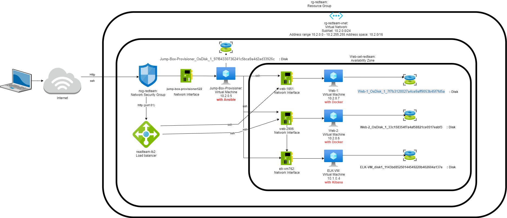

## Automated ELK Stack Deployment

The files in this repository were used to configure the network depicted below.

These files have been tested and used to generate a live ELK deployment on Azure. They can be used to either recreate the entire deployment pictured above. Alternatively, select portions of the **pentest.yml** file may be used to install only certain pieces of it, such as Filebeat.

  - [Pentest Yml file](https://github.com/slcassidy/HW13-ELK-Stack/blob/main/Ansible/pentest.yml)

This document contains the following details:
- Description of the Topologu
- Access Policies
- ELK Configuration
  - Beats in Use
  - Machines Being Monitored
- How to Use the Ansible Build

### Description of the Topology

The main purpose of this network is to expose a load-balanced and monitored instance of DVWA, the D*mn Vulnerable Web Application.

Load balancing ensures that the application will be highly **accessible & reliabile**, in addition to restricting *access* to the network.
- _What aspect of security do load balancers protect?_ 
  + Load balancer prevents VM overload as it spreads the load among multipule VMs.  There is also a health probe that verifies that the VMs can handle the volume of requests.
- _What is the advantage of a jump box?_
  + It locks down the entry point for admin tasks as all commands must connect through the jumpbox.  A JumpBox is a single entry point vs allowing admin commands directly on each VM**

Integrating an ELK server allows users to easily monitor the vulnerable VMs for changes to the **webservers** and system **logs**.
- _What does Filebeat watch for?_
  + Collects log files from specific files of interest about the file system
- _What does Metricbeat record?_
  + Collects machine metric logs

The configuration details of each machine may be found below.
_Note: Use the [Markdown Table Generator](http://www.tablesgenerator.com/markdown_tables) to add/remove values from the table_.

| Name     | Function    | IP Address | Operating System    |
|----------|-------------|------------|---------------------|
| Jump Box | Gateway     | 10.2.0.5   | Linux Ubuntu 18.04  |
| Web-1    | Webserver   | 10.2.0.7   | Linux Ubuntu 18.04  |
| Web-2    | Webserver   | 10.2.0.6   | Linux Ubuntu 18.04  |
| ELK-VM   | Monitoring  | 10.1.0.4   | Linux Ubuntu 18.04  |

### Access Policies

The machines on the internal network are not exposed to the public Internet. 

Only the **Jump Box** machine can accept connections from the Internet. Access to this machine is only allowed from the following IP addresses:
- XX.XXX.XXX.X26 (Personal IP address)

Machines within the network can only be accessed by **the Jump Box**.
- _Which machine did you allow to access your ELK VM?_
  + The Jump Box 
- _What was its IP address?_
  + Jumpbox: 10.2.0.5 

A summary of the access policies in place can be found in the table below.

| Name     | Publicly Accessible | Allowed IP Addresses         |
|----------|---------------------|------------------------------|
| Jump Box | Yes                 | 10.2.0.6, 10.2.0.7, 10.1.0.4 |
| Web-1    | No                  |     10.2.0.5                 |
| Web-2    | No                  |     10.2.0.5                 |
| ELK-VM   | No                  |     10.2.0.5                 |
### Elk Configuration

Ansible was used to automate configuration of the ELK machine. No configuration was performed manually, which is advantageous because...
- _What is the main advantage of automating configuration with Ansible?_
  + The advantage is that automating the configuration allows to have a repeatable process.  Allows speed in development reducing costs/time required for manually deployment (time is money).

The playbook implements the following tasks:
- _Explain the steps of the ELK installation play. E.g., install Docker; download image; etc._
- Add the private ip of the Elk VM to the Ansible `hosts` file and a separate section called `[elk]` similar to `[webservers]`
- Create an Ansible playbook with the [Install Elk Yml file](https://github.com/slcassidy/HW13-ELK-Stack/blob/main/Ansible/install-elk.yml) which include:
  + Identify the hosts where the configuration is to be applied to the `[elk]` section
  + Installation of Docker
  + Installation of pip3
  + Increase memory
  + Install Docker python module
    + Make include the restart the policy `restart_policy: always`
  + Download & launch docker to the elk container w/ specific ports
  + Enable the service docker to boot  

The following screenshot displays the result of running `docker ps` after successfully configuring the ELK instance.

### Target Machines & Beats
This ELK server is configured to monitor the following machines:
- 10.2.0.7 & 10.2.0.6 

We have installed the following Beats on these machines:
- filebeat configuration
- filebeat playbook
- metricbeat configuraion
- metricbeat playbook

These Beats allow us to collect the following information from each machine:
- _TODO: In 1-2 sentences, explain what kind of data each beat collects, and provide 1 example of what you expect to see. E.g., `Winlogbeat` collects Windows logs, which we use to track user logon events, etc._

### Using the Playbook
In order to use the playbook, you will need to have an Ansible control node already configured. Assuming you have such a control node provisioned: 

SSH into the control node and follow the steps below:
- Copy the **configuration** file to the **ansible container** `/etc/ansible/files`.
- Update the **configuration** file to include the **host private ip address plus the port as a host** `[your.VM.IP]:5601`
- Run the playbook, and navigate to **http://[your.VM.IP]:5601/app/kibana** to check that the installation worked as expected.

_Answer the following questions to fill in the blanks:_
- _Which file is the playbook?_
  + / 
  - _Where do you copy it?_
    + `/etc/ansible/`
- _Which file do you update to make Ansible run the playbook on a specific machine?_
  + filebeat-config / metricbeat-config
  - _How do I specify which machine to install the ELK server on versus which to install Filebeat on?_
  + They are the same server that installs the beats and the ELK
- _Which URL do you navigate to in order to check that the ELK server is running?
  + **http://[your.VM.IP]:5601/app/kibana**
**-----------------------------------------------------------------------------**
_**Bonus**, provide the specific commands the user will need to run to download the playbook, update the files, etc._
**Metricbeat**
- Download the config file by going to: `curl https://gist.githubusercontent.com/slape/58541585cc1886d2e26cd8be557ce04c/raw/0ce2c7e744c54513616966affb5e9d96f5e12f73/metricbeat >> /etc/ansible/metricbeat-config.yml`
- `mkdir files`
- `mv metricbeat-config.yml > files `
- `nano /etc/ansible/files/metricbeat-config`
- Update the hosts to ELK private IP
- `CTRL X`

**Filebeat**
- Download the config file by going to : `curl https://gist.githubusercontent.com/slape/5cc350109583af6cbe577bbcc0710c93/raw/eca603b72586fbe148c11f9c87bf96a63cb25760/Filebeat >> /etc/ansible/filebeat-config.yml`
- `mkdir files`
- `mv filebeat-config.yml > files `
- `nano /etc/ansible/files/filebeat-config`
- Update the hosts to ELK private IP
- `CTRL X`
